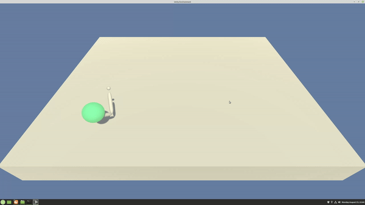

# Project 2: Continuous Control

## Project Details

### Problem Description
In this environment, a double-jointed arm can move to target locations.
A reward of +0.1 is provided for each step that the agent's hand is in the goal location.
Thus, the goal of the agent is to maintain its position at the target location for as many time steps as possible.

### State and Action Space
The observation space consists of 33 variables corresponding to position, rotation, velocity, and angular velocities of the arm.
Each action is a vector with four numbers, corresponding to torque applicable to two joints.
Every entry in the action vector must be a number between -1 and 1.

### Solving Condition
In order to solve the environment, the agent must get an average score of +30 over 100 consecutive episodes.

## Getting Started
1. Download the environment from one of the links below. You need only select the environment that matches your operating system:
    - Linux: [(click here)](https://s3-us-west-1.amazonaws.com/udacity-drlnd/P2/Reacher/one_agent/Reacher_Linux.zip)
    - Mac OSX: [(click here)](https://s3-us-west-1.amazonaws.com/udacity-drlnd/P2/Reacher/one_agent/Reacher.app.zip)
    - Windows (32-bit): [(click here)](https://s3-us-west-1.amazonaws.com/udacity-drlnd/P2/Reacher/one_agent/Reacher_Windows_x86.zip)
    - Windows (64-bit): [(click here)](https://s3-us-west-1.amazonaws.com/udacity-drlnd/P2/Reacher/one_agent/Reacher_Windows_x86_64.zip)

    Place the file in the `unity_env_single_agent/` folder, and unzip (or decompress) the file.

1. Install the pre-requisites using conda:
    ```
    conda env create --name drlnd_navigation --file=environment.yml
    ```

1. Create jupyter-notebook kernel
    ```
   python -m ipykernel install --user --name drlnd_navigation --display-name "drlnd_navigation"
    ```
    - Make sure to select kernel drlnd_navigation when executing jupyter-notebook

## Instructions
- To run the project using saved weights for the agent, execute the section "Watch a Smart Agent!" in the notebook `DDPG.ipynb`
- To train the network, execute the section "Train the Agent with DDPG" in the notebook `DDPG.ipynb`
