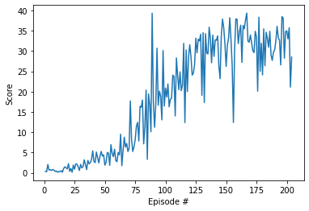

# Report: Continuous Control

## Algorithm
Deep Deterministic Policy Gradient (DDPG) algorithm is used to solve this problem.
DDPG is a model-free off-policy algorithm specially suited for learning continuous actions.
It has two networks:
1. Actor: It proposes an action given a state
2. Critic: It predicts if the action is good or bad given a state and action.

### Hyperparameters
| Hyperparameter | Description                          | Value |
|----------------|--------------------------------------|-------|
| BUFFER_SIZE    | replay buffer size                   | 1e6   |
| BATCH_SIZE     | minibatch size                       | 128   |
| GAMMA          | discount factor                      | 0.99  |
| TAU            | for soft update of target parameters | 1e-3  |
| LR_ACTOR       | learning rate for the actor          | 1e-4  |
| LR_CRITIC      | learning rate for the critic         | 2e-4  |
| WEIGHT_DECAY   | L2 weight decay                      | 0     |
| mu             | OU Noise mu                          | 0     |
| theta          | OU Noise theta                       | 0.15  |
| sigma          | OU Noise sigma                       | 0.1   |

### Model architectures
- Actor

| Layer | Input      | Output      |
|-------|------------|-------------|
| fc1   | state_size | 256         |
| bn1   | 128        | 128         |
| fc2   | 128        | 128         |
| fc3   | 128        | action_size |

- Critic

| Layer | Input             | Output |
|-------|-------------------|--------|
| fc1   | state_size        | 128    |
| bn1   | 128               | 128    |
| fc2   | 128 + action_size | 128    |
| fc3   | 128               | 1      |

## Change Log/Timeline
1. Started with DDPG algorithm in Udacity's DRL repo for pendulum.
    - Without any modification the score did not improve beyond 2.
2. After a few trial and errors changed `LR_ACTOR` to `2e-4`.
3. Added `Batch Normalization` for both Actor and Critic network
    - This improved score significantly
4. Fixed `OU Noise` to have `np.random.standard_random()` instead of `random.random()`
    - Score improved to ~25 but not improving beyond it
5. Added another hidden in Actor network
6. Reduced `LR_ACTOR` to `1e-4`
    - Average score not improving beyond ~26
7. Reduced `LR_CRITIC` to `1e-4`
8. Removed a hidden layer from critic.
9. Fixed premature termination of episodes, from 600 -> 10,000
    - I had adopted the starter code from some other project, that had max step size 700
    - This was the reason that the average score was not crossing 25

### D4PG
1. Started with the same baseline DDPG algorithm to start with multi agent environment.
2. Changed the algoritm to have one single `ReplayBuffer` that is shared among all agents
3. Changed `OU Noise` to `Gaussian Noise`
4. Training 50x slower than DDPG.
    - Will comeback to this later

## Plot of Rewards

## Ideas for Future Work
- Complete D4PG for multi agent environment.
- Try implement PPO, A3C algorithm for multi agent environment
